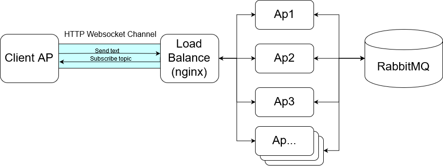

### Chatroom

To create a chatroom by communicating between server-side and client-side over HTTP Websocket. This project leverages Spring Boot and RabbitMQ to implement the main function. In the server-side, for the scalability, I use the message queue(RabbitMQ) as the system's broker serving a large number of client's message exchange requests. Moreover, make use of STOMP to provide publish/subscribe pattern. It is efficient to talk between server-side and client-side rather than long pooling mechanism.

The docker-compose file illustrated the deployment of architecture in production. There are main three parts which are Load Balance(Nginx), backend services and RabbitMQ. To achieve high traffic need, We can allocate enough backend services for client's connections through Load Balance to meet this requirement. Besides, RabbitMQ also plays a good role in a large distributed system.

this picture shows the architecture 



#### Project Folders
| Folder  |  Description  |
| ------------ | ------------ |
|  chatroom-client-stomp | Client-side source code. Java Gradle Project  |
|  chatroom-server-queue | Server-side source code. Java Gradle Project |
| docker |  docker-compose related files |

#### Run Server-side
Execute docker-compose command
```bash
cd docker
docker-compose up -d
```

#### Run Client-side
Execute Client Application (default server ip and port is 127.0.0.1:8080)
```bash
java -jar ./docker/chatclient/chatroom-client-stomp.jar
```
Specify server ip and port
```bash
java -jar ./docker/chatclient/chatroom-client-stomp.jar 192.168.1.1 80
```

